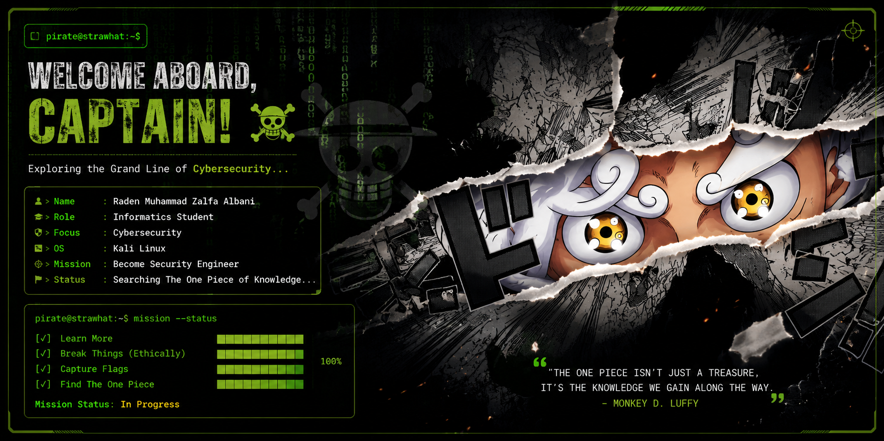

<p align="center">
  
</p>

<p align="center">
  
</p>

## 👒 About Me

```bash
> whoami

Name     : Raden Muhammad Zalfa Albani
Role     : Informatics Student
Focus    : Cybersecurity
OS       : Kali Linux
Learning : Web Security • Reverse Engineering • CTF
Dream    : Become a Security Engineer
```
📊 Grand Line Stats

<div align="center">


</div>
