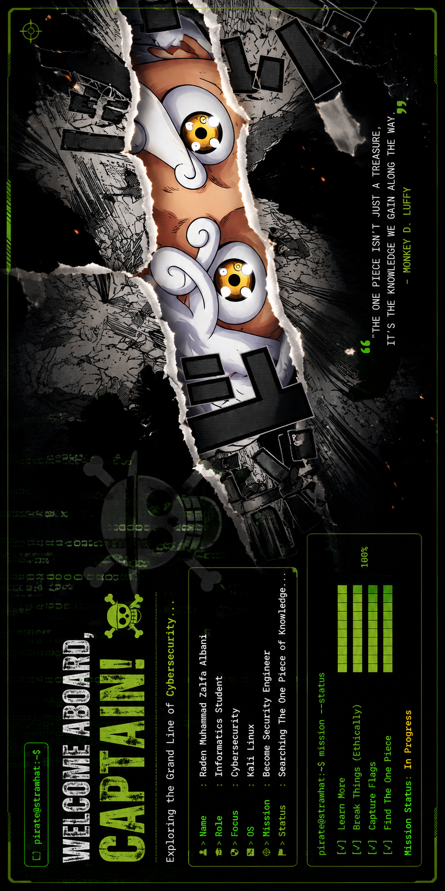

<p align="center">
  
</p>

# 👒 Hi, I'm Raden Muhammad Zalfa Albani

### 🏴‍☠️ Cybersecurity Student • Linux Enthusiast • Future Security Engineer

> *"Searching for the One Piece of Knowledge."*

<br>


</div>

---

<table>
<tr>

<td width="60%">

## ⚓ Captain Information

```bash
$ whoami

Name      : Raden Muhammad Zalfa Albani
Role      : Informatics Student
Location  : Indonesia
Ship       : Kali Linux
Focus      : Cybersecurity
Dream      : Security Engineer
Status     : Exploring Grand Line...
```

### 🧠 Currently Learning

- Web Security
- Reverse Engineering
- Linux
- Python Automation
- Digital Forensics
- Capture The Flag (CTF)

### ⚔ Devil Fruit

🍎 Hack-Hack no Mi

Special Ability

- Finding vulnerabilities
- Breaking things to learn
- Building secure applications

</td>

<td align="center">


</td>

</tr>
</table>

---

# ⚒️ Arsenal

<div align="center">


</div>

---

# 📊 Grand Line Stats

<div align="center">


</div>

---

# 🏆 Pirate Achievements

<div align="center">


</div>

---

# 🌊 Grand Line Voyage

<div align="center">


</div>

---

# 🐍 Sea King Trail

<div align="center">


</div>

---

# ⚓ Captain's Terminal

```text
━━━━━━━━━━━━━━━━━━━━━━━━━━━━━━━━━━━━━━━━━━━━━━

> booting...

Initializing Pirate OS...

✔ Python Loaded

✔ Linux Loaded

✔ Bash Loaded

✔ Git Loaded

✔ CTF Loaded

✔ Cybersecurity Loaded

Mission:
Become one of the best Security Engineers.

━━━━━━━━━━━━━━━━━━━━━━━━━━━━━━━━━━━━━━━━━━━━━━
```

---

# 📫 Connect With Me

<p align="center">

<a href="https://instagram.com/USERNAME">

</a>

<a href="https://linkedin.com/in/USERNAME">

</a>

<a href="mailto:email@gmail.com">

</a>

</p>

---

<div align="center">

## 👒 Pirate Quote

> **"The One Piece isn't treasure... it's the knowledge we gain during the journey."**


</div>
