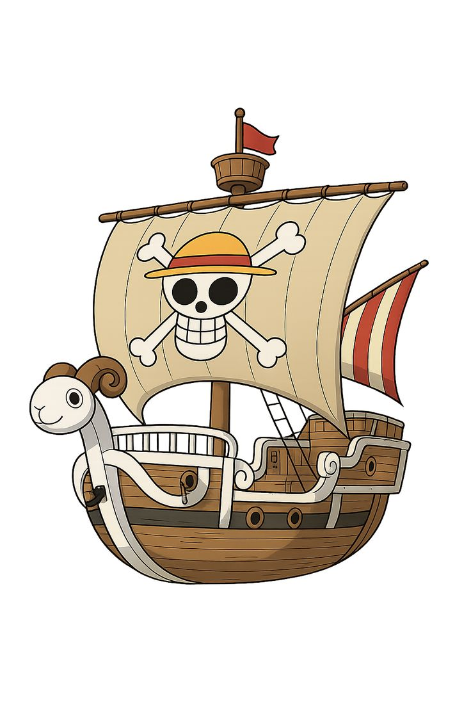

<p align="center">
  
</p>

<p align="center">
  
</p>

## 👒 About Me

```bash
> whoami

Name     : Raden Muhammad Zalfa Albani
Role     : Informatics Student
Focus    : Cybersecurity
OS       : Kali Linux
Learning : Web Security • Reverse Engineering • CTF
Dream    : Become a Security Engineer
```
<p align="center">  </p>

☠️ Current Mission
🍇 Learn More
⚫ Capture Flags
❤️ Build Open Source Projects
🔥 Master Linux
💜 Become Security Engineer

### 🕹️ Fun Section
<p align="center">
  
</p>
<div align="center">

"The One Piece isn't just a treasure, it's the knowledge we gain along the way."

— Monkey D. Luffy 👒
<p align="center">
  
</p>

⭐ Thanks for visiting my profile!

</div> 
